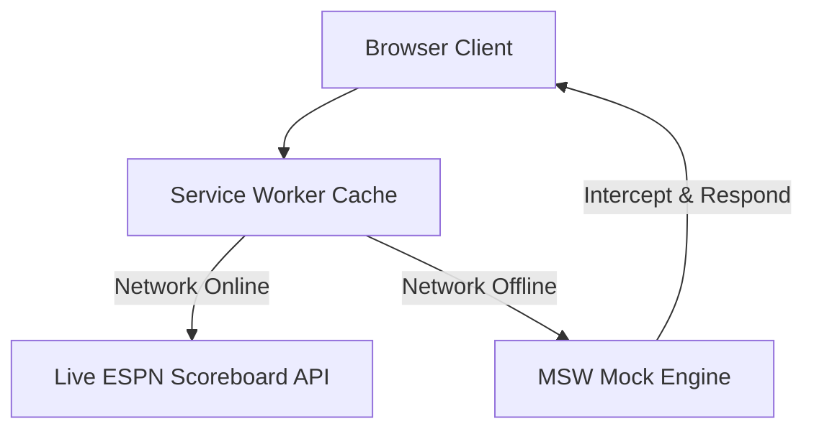

# Future Features & Roadmap

This document serves as a wishlist, design draft, and implementation roadmap for future features in the World Cup 2026 Dashboard.

---

## 1. Offline Support & PWA Integration with MSW

To make the dashboard fully functional offline, we can pair a Progressive Web App (PWA) configuration with Mock Service Worker (MSW) to intercept and serve mock data locally without an internet connection.

### Architecture Overview


### Setup Instructions

#### A. Install Vite PWA Plugin
```bash
bun add -d vite-plugin-pwa
```

#### B. Update `vite.config.ts`
```typescript
import { defineConfig } from "vite";
import react from "@vitejs/plugin-react";
import { VitePWA } from "vite-plugin-pwa";

export default defineConfig({
  plugins: [
    react(),
    VitePWA({
      registerType: "autoUpdate",
      includeAssets: ["favicon.ico", "hero.jpg"],
      manifest: {
        name: "World Cup 2026 Dashboard",
        short_name: "WC2026",
        description: "FIFA World Cup 2026 Dashboard with local timezones & scores",
        theme_color: "#0f0f0f",
        background_color: "#0f0f0f",
        display: "standalone"
      },
      workbox: {
        globPatterns: ["**/*.{js,css,html,ico,png,jpg,svg,woff2}"]
      }
    })
  ]
});
```

#### C. Enable Mocking Dynamically when Offline
In `src/main.tsx`:
```typescript
async function enableMocking() {
  const isOffline = typeof navigator !== "undefined" && !navigator.onLine;
  const forceMocks = import.meta.env.VITE_ENABLE_MSW === "true";

  if (forceMocks || isOffline) {
    const { worker } = await import("./mocks/browser");
    return worker.start({
      onUnhandledRequest: "bypass",
      serviceWorker: {
        url: "/mockServiceWorker.js"
      }
    });
  }
}
```

---

## 2. Future Features Wishlist

*Write down any new feature ideas, UI modifications, or API upgrades you'd like to implement in the future below:*

*   **[Example] Dark/Light Theme Toggle:** Allow users to manually toggle between dark and light modes (currently dark-only).
*   **[Example] Push Notifications:** Send browser alerts when a favorite team scores or when a match kicks off.
*   
